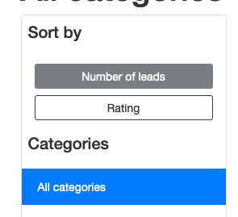
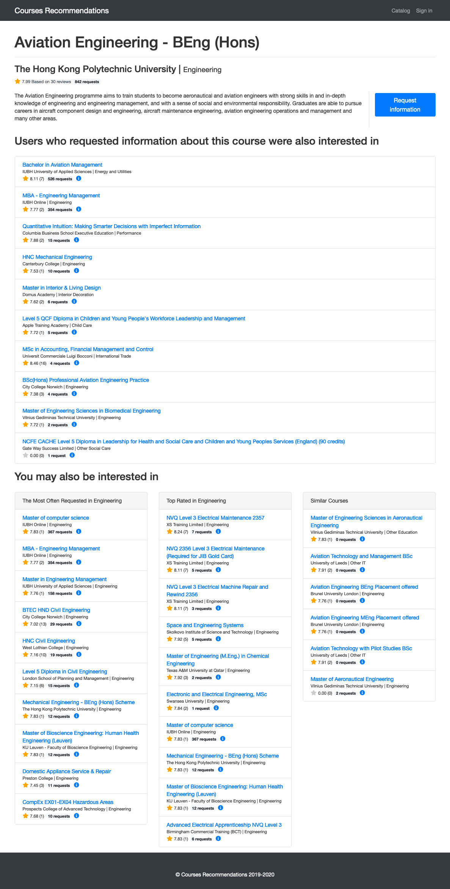
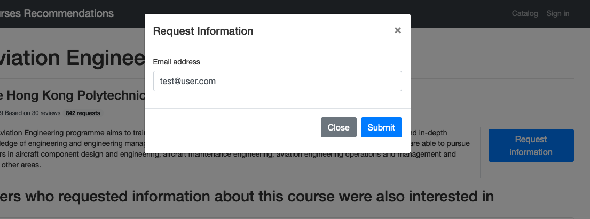
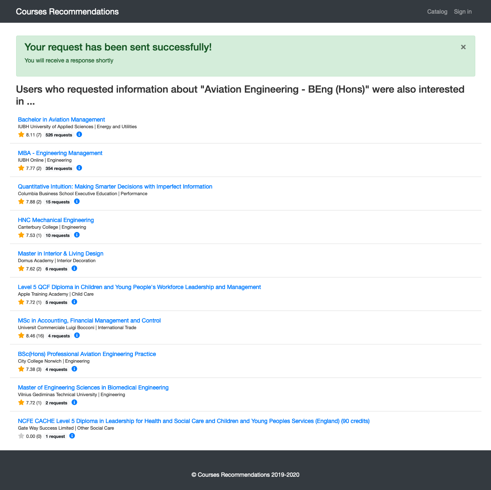
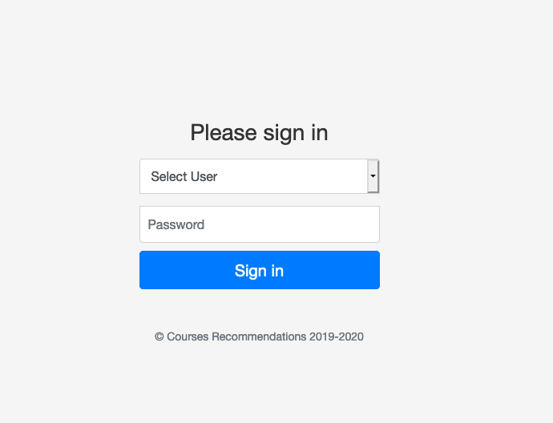

# Courses recommendations site
This is the fifth part of the Udacity Data Science Nanodegree capstone project, which consists in the creation of a course recommendation system.

## How to use the courses recommendations demo web

### Home page

Go to [https://courses-recommender.herokuapp.com/](https://courses-recommender.herokuapp.com/) and the home page looks like that:

In the home page we make three types of rank-based recommendations:
    
* Most often requested courses, on the left
* Top rated courses, on the right
* Top ten categories sorted by number of requests and average rating
    
### Catalog page
Click on [Catalog](https://courses-recommender.herokuapp.com/catalog) on the top right of the page:

The main container is a list of courses sorted by number of requests. You can change the order of the list by clicking on "Rating"
on the left sidebar.

In addition to the sorting buttons, in the left sidebar, there is a list of categories. By clicking on any of them, you can filter the list by categories.

### Course page
This is the course page:

After course description, you can see four blocks of recommendations:

* The block *Users who requested information about this were also interested in* recommends courses based on leads generated
by other users that also generated a lead on this course.
* The block *You may also be interested in* makes three types of recommendations: on the left, most often requested courses belonging to the same category as the current course.
In the middle, the most valued courses in the category. And on the right, a list of similar courses by content.

### Requesting information

You can request information about any course by clicking on the "Request information" button, then you must enter your email and click on "Submit"

In the response page, you will see recommendations based on the course you just requested information about:

### Registered users

You can navigate the site as a registered user. To do that, go to the [login page](https://courses-recommender.herokuapp.com/login) by clicking "Sign in" on the top right of the page,
choose one of the available users, enter the password and click on "Sign in".

The home page for registered users is slightly different, it includes a block of recommendations based on the history of leads generated by the current user

